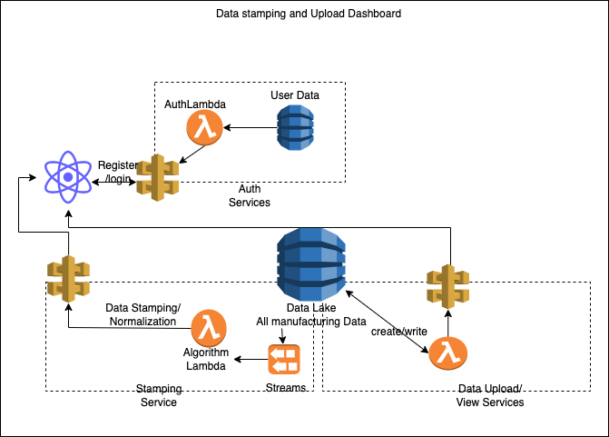

# Data Normalization and Stamping Dashboard

This is a cloud-enabled, webapp 💻

## Features

- Admin Login and Registration Authorization and Authentication service.
- Data Stamping and Normalization Service by Data admin
- Data View/Upload Service for Data users

## Technologies Use

| Technology | Usage |
| ------ | ------ |
| React | For UI |
| Vite | For React Bootstrapper |
| AWS Lambda  | For Logics/Transformation |
| AWS DynamoDb | For Data Storage |
| AWS API GW | For Apis |
| Axios | For Api Call |

